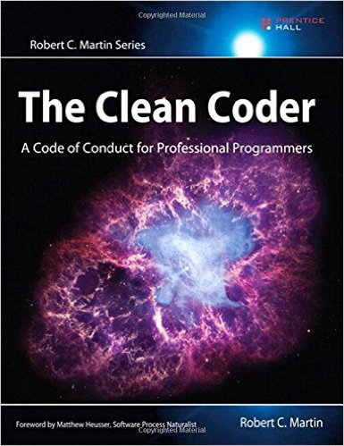

---

# What?

--

# What? (Overall)

* Clean Code
  * **Fundamentals**
  * SOLID principles
  * Component design
  * Design Patterns

--

# What? (Today)

* Clean Code
  * **Fundamentals**
    * **Names**
    * Functions
    * Form
    * Architecture

---

# How?

--

# How?

Agenda/Schedule

---

# Why?

--

# Why?
## Why are you here?

--

# Why?
## Clean code matters

(Tell the story about C/C++ debugger company)

--

# Why?
## Productivity trap

* Greenfield project (no constraints)
  * Burning new features every day!
  * Developers working hard, code slows them down
  * Managers: "Hire more developers!"
  * Developers: "Redesign!" (10 years example)

--

# Why?
## What to do?

--

# Why?
## Face the problem!

### Accept the fact
### that code rots

--

# Why?
## Rotten code indicators

* **Rigidity** - resist to change, requires lot of changes
* **Fragility** - simple change causes unintended defects
* **Inseparability** - parts are not reusable
* **Opacity** - hard to read, understand and change

--

# Why?
## Why the code rots?

--

# Why?
## Why the code rots?

* **Developers** are to blame

--

# Why?
## What to do?

--

# Why?
## Two options

* Write fast = rotten code = go slow
* Write clean = clean code = go fast

--

# Why?
## What is clean code?

--

# Why?
## What is clean code?

* Elegant and efficient
* Simple and direct
* Read like well written prose
* Written by someone who cares
* You read what you expect

--

# Why?
## Scout rule

---

# Who?

--

# Who?

## Robert C. Martin
### (Uncle Bob)


--

# Who?


--

# Who?



--

# Who?


---

# Today's topic

--

# Names

(video)

--

# Names

Short time-out?

--

# Names
## Reveal your intent

--

# Names
## Avoid disinformation

--

# Names
## Pronounceable Names

--

# Names
## Avoid encoding

--

# Names
## Parts of speech

--

# Names
## Names length

--

# Names
## Guess the problem?

* Object
* Pair
* First
* Base

--

# Names
## Guess the problem?

```php
public $d; // Elapsed time in days.

public function months($months);

/* Useful constant */

define('INCLUDE_BOTH', 1);
```

--

# Names
## Guess the problem?

* $aMonths
* $blFalse
* $sName
* $pCollection

--

# Names
## Guess the problem?

* getYYYY
* mm
* prntf
* qty_test

--

# Names
## Guess the problem?

```php
foreach ($tr as $r) {
  $element = createElement($d, $r);
  $root->append($element);
}
```

--

# Names
## Guess the problem?

```php
public function base();
public function box();
public $getStatus;
const GET_DOCUMENT_STATUS = 1;
class AddingToProvide {}
```

---

# Homework

--

# Homework

* Find 2-3 examples for each name issue

* Format:
  * [Name of the issue]
  * [Example link]
  * [Suggestion how to fix it]
  * Bonus: [link to your PR]

* Send the list to edvinas.aleksejonokas@nfq.lt

--

# Questions?

--

# Thank you!
